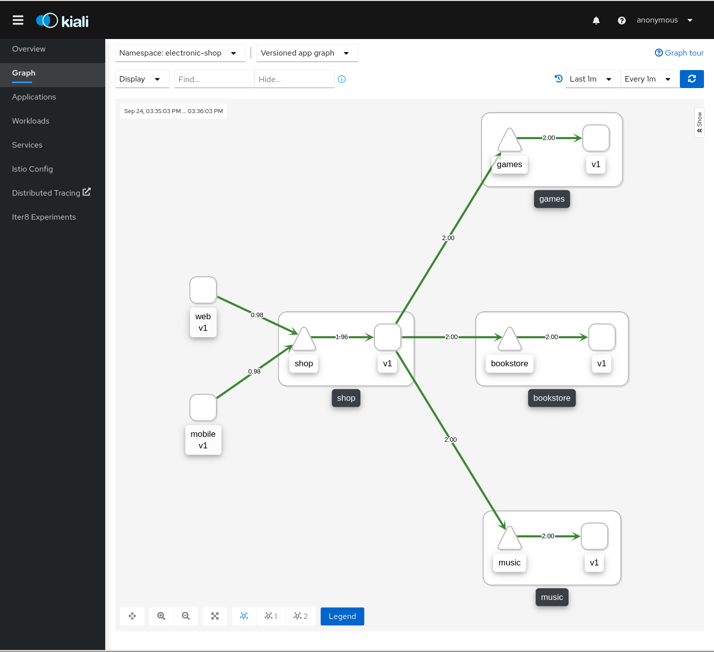
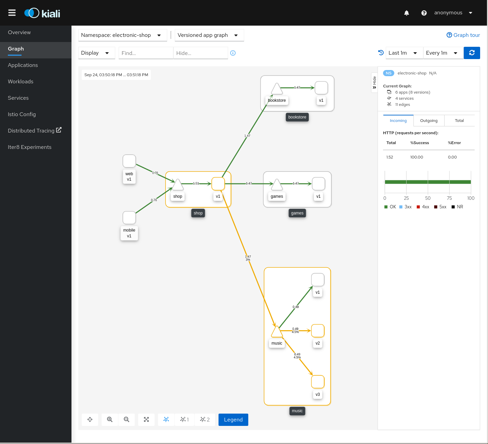

= Electronic Shop Demo

A set of clients and servers that simulate an electronic shop.

This demo will perform a canary release by changing one version of a component by other evaluating the behaviour of the new version.

== Platform Install

This demo has been tested using https://istio.io/latest/docs/setup/platform-setup/minikube/[Minikube] and https://istio.io/latest/docs/setup/install/istioctl/#install-a-different-profile[Istio 1.6 Demo Profile]

Additional configurations are needed in a case of installing on https://istio.io/latest/docs/setup/platform-setup/openshift/[OpenShift]

== Quick Start

Create `electronic-shop` namespace. Add `istio-injection` label and deploy demo app.

[source,yaml]
----
kubectl create namespace electronic-shop
kubectl label namespace electronic-shop istio-injection=enabled
kubectl apply -f electronic-shop.yaml -n electronic-shop

kubectl apply -f <(curl -L https://raw.githubusercontent.com/kiali/demos/master/electronic-shop/electronic-shop.yaml) -n electronic-shop
----

Open Kiali dashboard:

[source,bash]
----
istioctl dashboard kiali

----

Undeploy the example:

[source,yaml]
----
kubectl delete -f <(curl -L https://raw.githubusercontent.com/kiali/demos/master/electronic-shop/electronic-shop.yaml) -n electronic-shop

kubectl delete namespace electronic-shop
----

== Electronic Shop Demo Design

This demo deploys a set of microservices in the electronic-shop namespace simulating a basic shop consisting on:

- Web and Mobile workloads that simulate access from Web and Mobile devices to the shop.
- A main Shop service collects Games, Books and Music and interacts with the Web and Mobile workloads.

In a first iteration, all services have deployed a first version like it's shown in the screenshot:

In the next step we are going to deploy new versions of the Music service with different behaviour:

[source,yaml]
----
kubectl apply -f <(curl -L https://raw.githubusercontent.com/kiali/demos/master/electronic-shop/music-v2.yaml) -n electronic-shop
kubectl apply -f <(curl -L https://raw.githubusercontent.com/kiali/demos/master/electronic-shop/music-v3.yaml) -n electronic-shop
----

Once evaluated new version of the Music service, we can deploy new versions for Games and Bookstore service using external services mapped in the Mesh using ServiceEntries.

For Games service:

[source,yaml]
----
kubectl apply -f <(curl -L https://raw.githubusercontent.com/kiali/demos/master/electronic-shop/games-service-entry.yaml) -n electronic-shop
kubectl apply -f <(curl -L https://raw.githubusercontent.com/kiali/demos/master/electronic-shop/games-v2.yaml) -n electronic-shop
----

For Bookstore service:

[source,yaml]
----
kubectl apply -f <(curl -L https://raw.githubusercontent.com/kiali/demos/master/electronic-shop/bookstore-service-entry.yaml) -n electronic-shop
kubectl apply -f <(curl -L https://raw.githubusercontent.com/kiali/demos/master/electronic-shop/bookstore-v2.yaml) -n electronic-shop
----

== Egress Traffic

In the previous step, the bookstore-v2 workload connects to the www.bookdepository.com external service.

In this step we are going to define a Gateway to transparently route the external traffic through an egress workload.

[source,yaml]
----
kubectl apply -f <(curl -L https://raw.githubusercontent.com/kiali/demos/master/electronic-shop/bookstore-egress-service-entry.yaml) -n electronic-shop
----

