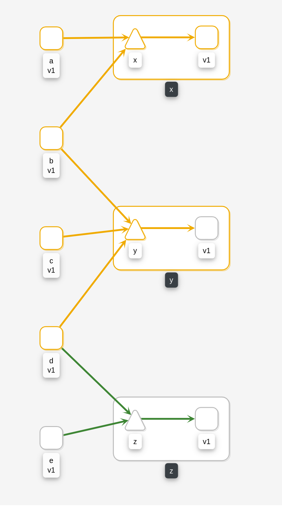

= Error Rates Demo

A set of clients and servers that simulate different error requests.

== Platform Install

This demo has been tested using https://istio.io/latest/docs/setup/platform-setup/minikube/[Minikube] and https://istio.io/latest/docs/setup/install/istioctl/#install-a-different-profile[Istio 1.6 Demo Profile]

== Quick Start

Create `alpha` and `beta` namespaces. Add `istio-injection` label and deploy demo app.

[source,yaml]
----
kubectl create namespace alpha
kubectl create namespace beta

kubectl label namespace alpha istio-injection=enabled
kubectl label namespace beta istio-injection=enabled

kubectl apply -f <(curl -L https://raw.githubusercontent.com/kiali/demos/master/error-rates/alpha.yaml) -n alpha
kubectl apply -f <(curl -L https://raw.githubusercontent.com/kiali/demos/master/error-rates/beta.yaml) -n beta

----

Open Kiali dashboard:

[source,bash]
----
istioctl dashboard kiali

----

Undeploy the example:

[source,yaml]
----
kubectl delete -f <(curl -L https://raw.githubusercontent.com/kiali/demos/master/error-rates/alpha.yaml) -n alpha
kubectl delete -f <(curl -L https://raw.githubusercontent.com/kiali/demos/master/error-rates/beta.yaml) -n beta

kubectl delete namespace alpha
kubectl delete namespace beta
----

== Error Rates Demo Design

This demo creates two namespaces (alpha, and beta) with the same topology of microservices.

A namespace will have three servers (x-server, y-server and z-server) that may simulate a predictable error rate.

"x" server will generate 404 HTTP errors, meanwhile "y" server will generate 505 errors; "z" server will not generate errors codes to act as contrast.

There will be five clients (a-client, b-client, c-client, d-client and e-client) calling one or more servers (x-server, y-server, z-server).

The goal of this setup is to demostrate Kiali Health Config capabilities where a user can define tolerance levels to indicate when an error rate is considered healthy, degraded or failed status.

=== Configurable Error Rates

Servers can configure the ratio and type of errors using ENV vars.

So in alpha.yaml we can see a couple of examples:

[source]
----

  # Send 9 200 HTTP responses per 1 500 HTTP response ~ 10% of HTTP 500 error rate
  [...]
  env:
    - name: CODE_REQUESTS
      value: "200,9;500,1"
  [...]

  # Send 9 200 HTTP responses per 1 404 HTTP response ~ 10% of HTTP 404 error rate
  env:
    - name: CODE_REQUESTS
      value: "200,9;404,1"

----