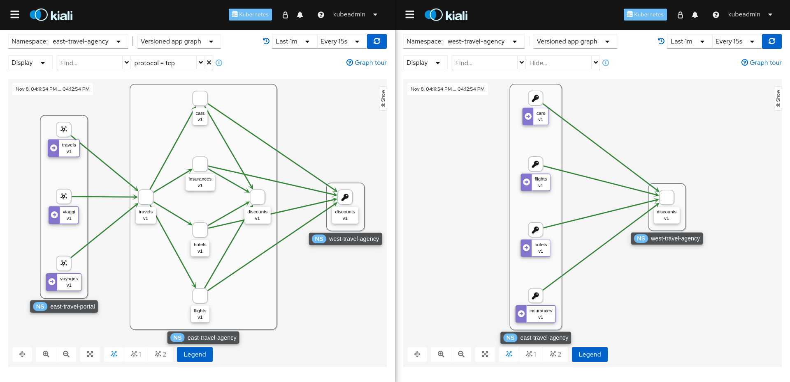

# Federated Travels application with OpenShift Service Mesh

Demo based on [Travels](../travels) application to show the federation capabilities of OpenShift Service Mesh.

## Demo Design

This demo creates two independent meshes on the same OpenShift cluster (for convenience but they can be split into different clusters as well) and federates them importing/exporting services in both meshes.

First, the *east* mesh will import the *discounts* service from *west* mesh. Finally, with a VirtualService all services deployed in the *east* mesh will consume both instances of the *discounts* service.

As this is a federation, and the service meshes are independent, there will be two instances of Kiali.

Open both Kiali instances side by side to observe the full topology:



## Platform Install

This demo has been tested using [CodeReady Containers 1.34](https://access.redhat.com/documentation/en-us/red_hat_codeready_containers/1.34/html/getting_started_guide) and [OpenShift Service Mesh 2.1](https://docs.openshift.com/container-platform/4.9/service_mesh/v2x/servicemesh-release-notes.html)

### CodeReady Containers

Set up your host machine for CodeReady Containers:

```bash
crc setup
```

Start the CodeReady Containers virtual machine with the recommended amount of RAM (16Gb):

```bash
crc start --memory 16384
```

Run the following command to add the cached oc executable to your PATH:

```bash
eval $(crc oc-env)
```

Log in as a cluster admin user to install the operators needed:

```bash
oc config use-context crc-admin
```

### OpenShift Service Mesh 2.1

Subscribe to the required operators (Jaeger, Kiali and OpenShift Service Mesh):

```bash
oc apply -f https://raw.githubusercontent.com/kiali/demos/master/federated-travels/ossm-subs.yaml
```

Install two independent meshes (*east* and *west*):

```bash
oc create namespace east-mesh-system
oc apply -n east-mesh-system -f east/east-ossm.yaml

oc create namespace west-mesh-system
oc apply -n west-mesh-system -f west/west-ossm.yaml
```

Wait for both control planes to be ready and create in each mesh namespace a configmap containing a root certificate that is used to validate client certificates in the trust domain used by the other mesh:

```bash
oc get configmap istio-ca-root-cert -o jsonpath='{.data.root-cert\.pem}' -n east-mesh-system > east-cert.pem
oc create configmap east-ca-root-cert --from-file=root-cert.pem=east-cert.pem -n west-mesh-system

oc get configmap istio-ca-root-cert -o jsonpath='{.data.root-cert\.pem}' -n west-mesh-system > west-cert.pem
oc create configmap west-ca-root-cert --from-file=root-cert.pem=west-cert.pem -n east-mesh-system
```

Configure all the federation resources for travels application:

```bash
oc apply -n east-mesh-system -f east/east-federation.yaml
oc apply -n west-mesh-system -f west/west-federation.yaml
```

For more information about how federation works, visit the [https://docs.openshift.com/container-platform/4.9/service_mesh/v2x/ossm-federation.html](documentation)

## Application Install

Create the application resources:

```bash
oc create namespace east-travel-agency
oc create namespace east-travel-portal
oc create namespace east-travel-control

oc apply -n east-travel-agency -f east-travel-agency.yaml
oc apply -n east-travel-portal -f east-travel-portal.yaml
oc apply -n east-travel-control -f east-travel-control.yaml

oc create namespace west-travel-agency

oc apply -n west-travel-agency -f west-travel-agency.yaml
```

## Cleanup

Delete all namespaces:

```bash
oc delete namespace east-travel-agency east-travel-control east-travel-portal east-mesh-system west-travel-agency west-mesh-system 
```