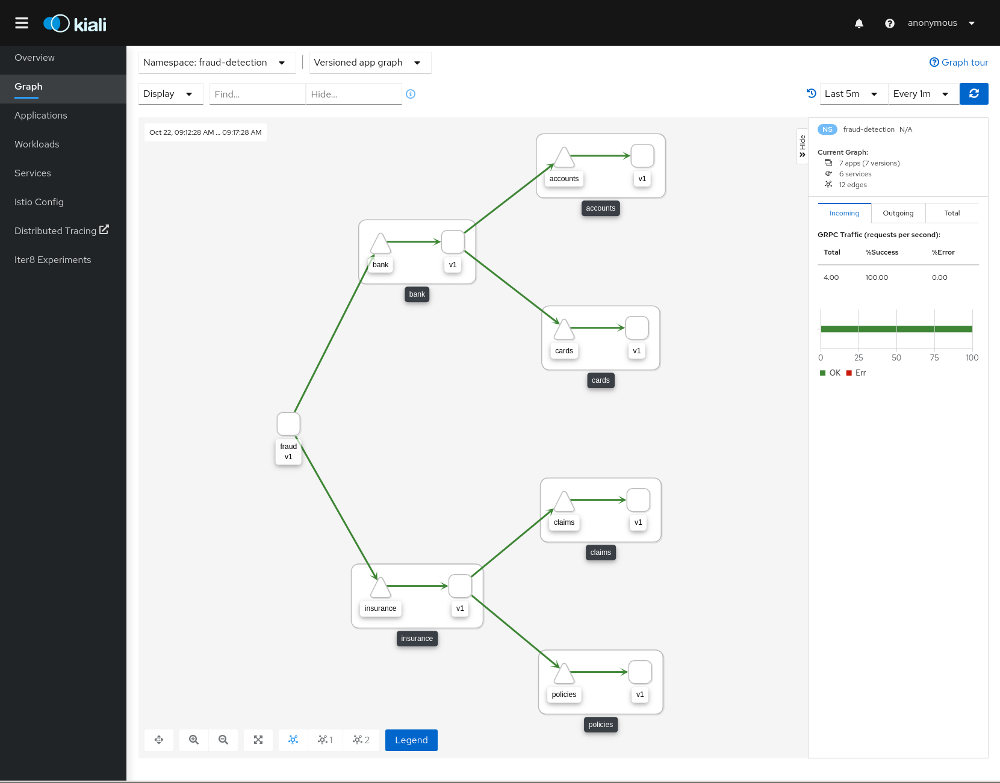

= Fraud Detection Demo

A set of gRPC clients and servers that simulate a fraud detection scenario.

This demo is designed to test tcp/http2/grpc traffic features under a Service Mesh.

== Platform Install

This demo has been tested using https://istio.io/latest/docs/setup/platform-setup/minikube/[Minikube] and https://istio.io/latest/docs/setup/install/istioctl/#install-a-different-profile[Istio 1.7 Demo Profile]

Additional configurations are needed in a case of installing on https://istio.io/latest/docs/setup/platform-setup/openshift/[OpenShift]

== Quick Start

Create `fraud-detection`. Add `istio-injection` label and deploy demo app.

[source,yaml]
----
kubectl create namespace fraud-detection

kubectl label namespace fraud-detection istio-injection=enabled

kubectl apply -f <(curl -L https://raw.githubusercontent.com/kiali/demos/master/fraud-detection/accounts.yaml) -n fraud-detection
kubectl apply -f <(curl -L https://raw.githubusercontent.com/kiali/demos/master/fraud-detection/cards.yaml) -n fraud-detection
kubectl apply -f <(curl -L https://raw.githubusercontent.com/kiali/demos/master/fraud-detection/bank.yaml) -n fraud-detection
kubectl apply -f <(curl -L https://raw.githubusercontent.com/kiali/demos/master/fraud-detection/policies.yaml) -n fraud-detection
kubectl apply -f <(curl -L https://raw.githubusercontent.com/kiali/demos/master/fraud-detection/claims.yaml) -n fraud-detection
kubectl apply -f <(curl -L https://raw.githubusercontent.com/kiali/demos/master/fraud-detection/insurance.yaml) -n fraud-detection
kubectl apply -f <(curl -L https://raw.githubusercontent.com/kiali/demos/master/fraud-detection/fraud.yaml) -n fraud-detection
----

Open Kiali dashboard:

[source,bash]
----
istioctl dashboard kiali

----

Undeploy the example:

[source,yaml]
----
kubectl delete -f <(curl -L https://raw.githubusercontent.com/kiali/demos/master/fraud-detection/accounts.yaml) -n fraud-detection
kubectl delete -f <(curl -L https://raw.githubusercontent.com/kiali/demos/master/fraud-detection/cards.yaml) -n fraud-detection
kubectl delete -f <(curl -L https://raw.githubusercontent.com/kiali/demos/master/fraud-detection/bank.yaml) -n fraud-detection
kubectl delete -f <(curl -L https://raw.githubusercontent.com/kiali/demos/master/fraud-detection/policies.yaml) -n fraud-detection
kubectl delete -f <(curl -L https://raw.githubusercontent.com/kiali/demos/master/fraud-detection/claims.yaml) -n fraud-detection
kubectl delete -f <(curl -L https://raw.githubusercontent.com/kiali/demos/master/fraud-detection/insurance.yaml) -n fraud-detection
kubectl delete -f <(curl -L https://raw.githubusercontent.com/kiali/demos/master/fraud-detection/fraud.yaml) -n fraud-detection

kubectl delete namespace fraud-detection
----

== Fraud Detection Demo Design

This demo creates a `fraud-detection` namespace with a main workload called `fraud`.

This workload simulates that a bank system filters some customer operations and it triggers a fraud detection process on them.

The "fraud detection process" is not part of the demo, but it simulates that per one operation, the process requests specific information about banking and insurance movements to correlate and calculate a risk factor.

The details of the business logic are very simplistic just focusing into the communication between multiple microservices to collect information from accounts, cards, policies and claims as it's shown in the diagram below.

