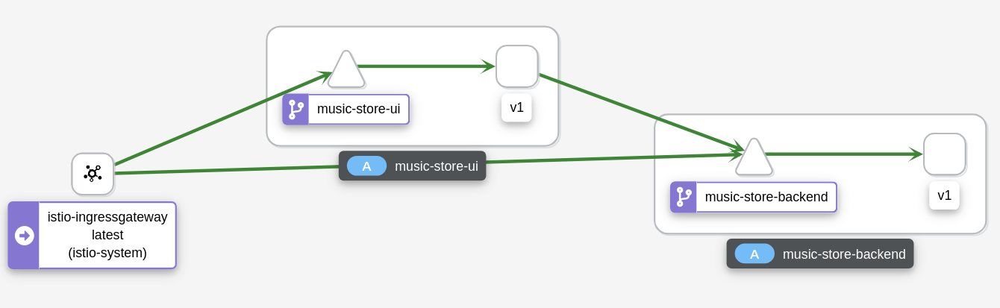
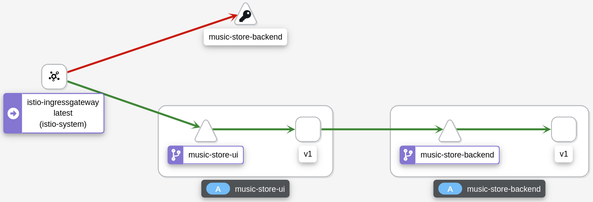
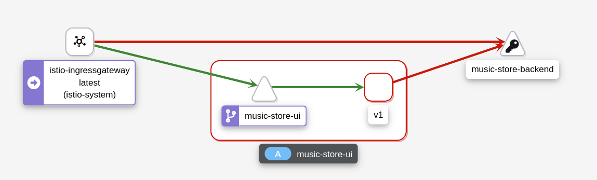

= Music Store Demo

A demonstration about how traffic rules are applied on internal and external traffic. These scenarios can be managed and observed by Kiali. 

== Platform Install

This demo has been tested using https://istio.io/latest/docs/setup/platform-setup/minikube/[Minikube] and https://istio.io/latest/docs/setup/install/istioctl/#install-a-different-profile[Istio 1.10 Demo Profile].

== Quick Start

Start a Minikube instance:

[source,bash]
----
minikube start --memory=8g --cpus=4
----

Install Istio and its addons:

[source,bash]
----
istioctl install --set profile=demo -y

kubectl apply -f https://raw.githubusercontent.com/istio/istio/release-1.10/samples/addons/prometheus.yaml
kubectl apply -f https://raw.githubusercontent.com/istio/istio/release-1.10/samples/addons/grafana.yaml
kubectl apply -f https://raw.githubusercontent.com/istio/istio/release-1.10/samples/addons/jaeger.yaml
kubectl apply -f https://raw.githubusercontent.com/istio/istio/release-1.10/samples/addons/kiali.yaml
----

A very simple microservice architecture based on https://github.com/leandroberetta/mimik[Mimik] will be used to demonstrate the concepts:

[source,bash]
----
kubectl create namespace music-store
kubectl label namespace music-store istio-injection=enabled

kubectl apply -f https://raw.githubusercontent.com/leandroberetta/demos/master/music-store/ui.yaml -n music-store
kubectl apply -f https://raw.githubusercontent.com/leandroberetta/demos/master/music-store/backend.yaml -n music-store
----

Wait for the music-store pods to become available:

[source,bash]
----
kubectl wait --for condition=available deployment/music-store-backend-v1 -n music-store
kubectl wait --for condition=available deployment/music-store-ui-v1 -n music-store
----

Configure the following environment variables to consume the services:

[source,bash]
----
export INGRESS_PORT=$(kubectl -n istio-system get service istio-ingressgateway -o jsonpath='{.spec.ports[?(@.name=="http2")].nodePort}')
export INGRESS_HOST=$(minikube ip)
export GATEWAY_URL=$INGRESS_HOST:$INGRESS_PORT
export MUSIC_STORE_UI=http://$GATEWAY_URL/
export MUSIC_STORE_BACKEND=http://$GATEWAY_URL/api
----

Create the following Istio routing resources:

[source,bash]
----
cat <<EOF | kubectl apply -f -
apiVersion: networking.istio.io/v1alpha3
kind: Gateway
metadata:
  name: music-store
  namespace: music-store
spec:
  selector:
    istio: ingressgateway
  servers:
    - port:
        number: 80
        name: http
        protocol: HTTP
      hosts:
        - "*"
---        
apiVersion: networking.istio.io/v1alpha3
kind: VirtualService
metadata:
  name: music-store-ui
  namespace: music-store
spec:
  hosts:
    - "*"
  gateways:
    - music-store
  http:
    - match:
        - uri:
            exact: /
      route:
        - destination:
            host: music-store-ui       
            port:
              number: 8080
    - match:
        - uri:
            prefix: /api
      route:
        - destination:
            host: music-store-backend
            port:
              number: 8080
EOF
----

== Music Store Demo Design

Generate some requests to both the UI and the backend from outside the mesh (notice that the UI consumes the backend too).

[source,bash]
----
for i in {1..100}; 
do 
  echo "UI request $i"
  curl $MUSIC_STORE_UI | jq
  echo "Backend request $i"
  curl $MUSIC_STORE_BACKEND | jq
  sleep 1
done
----

Inspect the graph in Kiali and expect the following topology:



Notice that the backend is consumed by an external client (through the ingress gateway) and also by the UI.

The next step is to add a traffic management rule, for example a fault injection in the backend to start returning a 500 error in every request:

[source,bash]
----
cat <<EOF | kubectl apply -f -
apiVersion: networking.istio.io/v1alpha3
kind: VirtualService
metadata:
  name: music-store-ui
  namespace: music-store
spec:
  hosts:
    - "*"
  gateways:
    - music-store
  http:
    - match:
        - uri:
            exact: /      
      route:
        - destination:
            host: music-store-ui            
            port:
              number: 8080
    - match:
        - uri:
            prefix: /api
      fault:
        abort:
          httpStatus: 500
          percentage:
            value: 100
      route:
        - destination:
            host: music-store-backend            
            port:
              number: 8080
EOF
----

Inspect the graph in Kiali:



Notice that the rule is applying to the external client only but the internal client (the UI) is still working good. 

This behaviour is expected because in the backend's VirtualService there is a missing configuration for the rule to affect internal traffic.

In the VirtualService, the only gateway that is configured is the one that is related to the Ingress Gateway (external traffic getting into the mesh). This means internal traffic is not being controlled by this rule. To fix this situation, a special value "mesh" can be configured in the gateways list as follows:

[source,bash]
----
cat <<EOF | kubectl apply -f -
apiVersion: networking.istio.io/v1alpha3
kind: VirtualService
metadata:
  name: music-store-ui
  namespace: music-store
spec:
  hosts:
    - "*"
  gateways:
    - music-store
    - mesh
  http:
    - match:
        - uri:
            exact: /      
      route:
        - destination:
            host: music-store-ui            
            port:
              number: 8080
    - match:
        - uri:
            prefix: /api
      fault:
        abort:
          httpStatus: 500
          percentage:
            value: 100
      route:
        - destination:
            host: music-store-backend            
            port:
              number: 8080
EOF
----

The previous command should fail with the following error:

```
admission webhook "validation.istio.io" denied the request: configuration is invalid: wildcard host * is not allowed for virtual services bound to the mesh gateway
```

As the error indicates, the "mesh" gateway is not allowed to be used when a wildcard host ("*") is also configured. To fix this situation, change the above command by replacing the wildcard with the two possible hosts that consume the backend:

[source,bash]
----
cat <<EOF | kubectl apply -f -
apiVersion: networking.istio.io/v1alpha3
kind: VirtualService
metadata:
  name: music-store-ui
  namespace: music-store
spec:
  hosts:
    - $(minikube ip)
    - music-store-backend.music-store.svc.cluster.local
  gateways:
    - music-store
    - mesh
  http:
    - match:
        - uri:
            exact: /      
      route:
        - destination:
            host: music-store-ui            
            port:
              number: 8080
    - match:
        - uri:
            prefix: /api
      fault:
        abort:
          httpStatus: 500
          percentage:
            value: 100
      route:
        - destination:
            host: music-store-backend            
            port:
              number: 8080
EOF 
----

Inspect the graph in Kiali again and observe that the rule is applying for both external and internal calls to the backend:



