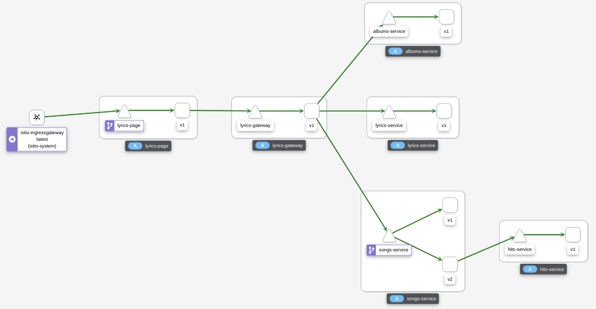
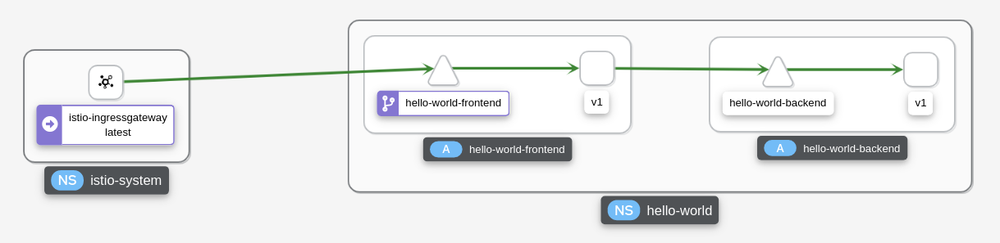
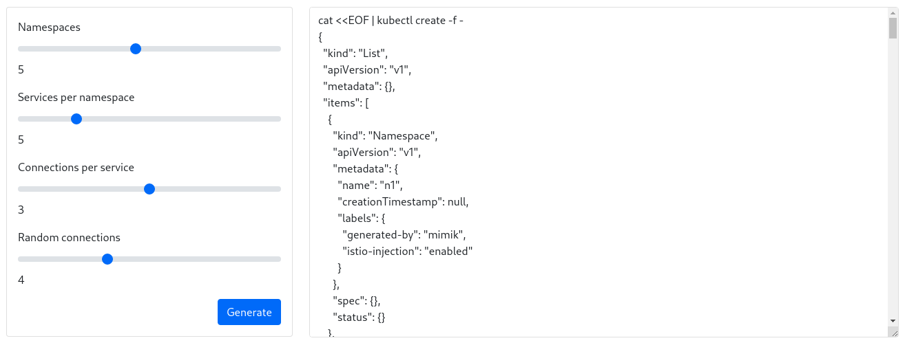

# Mimik

Simulate being a service (or many) in a mesh.

Helpful to test Istio features like traffic routing, tracing, security and more. 



## Introduction

Basically what Mimik does is to imitate a service that listens to certain paths and methods, and connects these with upstream connections (that usually are Mimik instances too) forming a service mesh.

## Getting started

Mimik instances run on Kubernetes clusters. The easiest way to create them is with Mimik operator. Check the [documentation](https://github.com/leandroberetta/mimik-operator) to install it. 

## Hello World Example

The following example will deploy a minimal mesh based on two services, a frontend and a backend and also configure Istio basic resources to expose the frontend: 

```yaml
apiVersion: mimik.veicot.io/v1alpha1
kind: Mimik
metadata:
  name: hello-world-frontend-v1
  namespace: hello-world
spec:
  service: hello-world-frontend
  version: v1
  endpoints:
    - path: /
      method: GET
      connections:
        - service: hello-world-backend
          port: 8080
          path: hello
          method: GET
---      
apiVersion: mimik.veicot.io/v1alpha1
kind: Mimik
metadata:
  name: hello-world-backend-v1
  namespace: hello-world
spec:
  service: hello-world-backend
  version: v1
  endpoints:
    - path: /hello
      method: GET
      connections: []
---
apiVersion: networking.istio.io/v1alpha3
kind: Gateway
metadata:
  name: hello-world
  namespace: hello-world
spec:
  selector:
    istio: ingressgateway
  servers:
    - port:
        number: 80
        name: http
        protocol: HTTP
      hosts:
        - "*"
---
apiVersion: networking.istio.io/v1alpha3
kind: VirtualService
metadata:
  name: hello-world
  namespace: hello-world
spec:
  hosts:
    - "*"
  gateways:
    - hello-world
  http:
    - route:
        - destination:
            host: hello-world-ui
            port:
              number: 8080
```

After a few requests, the following topology can be seen in the graph generated by Kiali:



## Generator

A generator is available to create random topologies and test different situations:



### Installation

Create the application:

```bash
kubectl create ns topology-generator
kubectl apply -n topology-generator -f https://raw.githubusercontent.com/kiali/demos/master/topology-generator/generator.yaml 
```

Visit the application through a proxy:

```bash
kubectl port-forward svc/topology-generator 8080:8080 -n topology-generator
```

Configure the following parameters and then generate the topology:

* Number of namespaces
* Number of services per namespace
* Number of connections between services in the same namespace
* Number of random connections between services in different namespaces

Copy the generated command and execute it in a terminal.

As a result, the topology will be created to be observed and managed by Kiali:


### Cleanup

Delete all namespaces generated by the application:

```bash
kubectl delete ns --selector=generated-by=mimik
```

Delete the topology generator:

```bash
kubectl delete namespace topology-generator
```