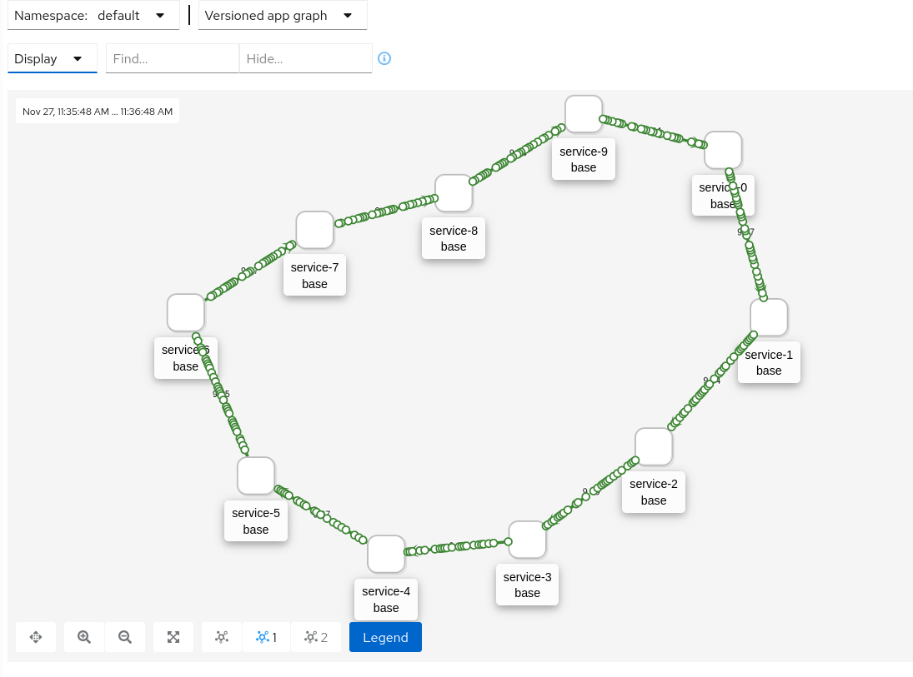

# Service Spawner

A simple script to spawn any number of services (deployments) in Kubernetes, each of them sending requests to the next one.

To use it, just clone the repo and run `gen-services.sh` piping to `kubectl apply`.

E.g.

```bash
./gen-services.sh 10 | k apply -f -
```

With a namespace:

```bash
./gen-services.sh 10 -n mynamespace | k apply -f -
```

The result in Kiali:



## Undeploy

```bash
kubectl delete all -l project=service-spawner
```
