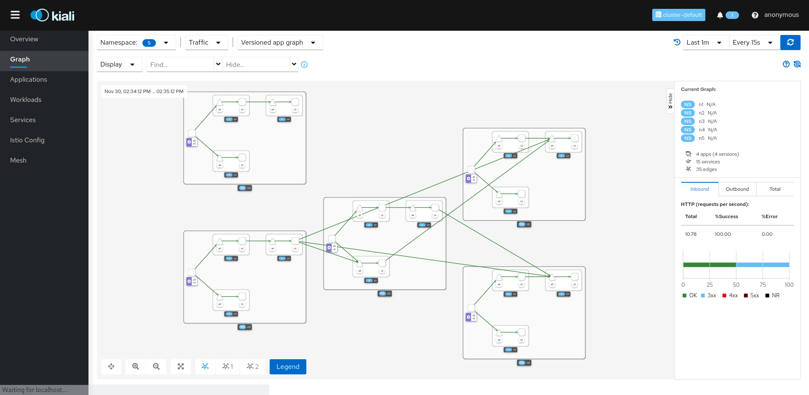

# Topology Generator

The generator creates a topology based on different instances of the same application called Mimik. 

Basically what Mimik does is to imitate a service that listens to certain paths and methods, and connects these with upstream connections (that usually are Mimik instances too) forming a service mesh.

The topology is generated based on some parameters like:

* Number of namespaces
* Number of services per namespace
* Number of connections between services in the same namespace
* Number of random connections between services in different namespaces

## Commands

You can refer to [docs](doc/commands/topogen.md) to learn how to use topology-generator.

```bash
topogen (topology-generator) is a powerful tool for building complex topology 💪, 
        you can choose to create specific topology with commands or in the UI 🌈.

Usage:
  topogen [command]

Available Commands:
  clean       Clean the generated topology in the Cluster
  completion  Generate the autocompletion script for the specified shell
  config      Generate topology config with commands
  doc         Generate the latest commmands docs
  help        Help about any command
  instance    The instance running in topology
  run         Deploy and Run the generated config to Cluster
  server      The web server for UI of Topology Generator

Flags:
  -h, --help   help for topogen

Use "topogen [command] --help" for more information about a command.
```

## Build and Use Binary

Build `topogen` binary:

```bash
make build-binary
```

Add built binary called `topogen` to your PATH,

Run `topogen -v` to see if it works.


## Build and Use Docker Image

Build Docker locally:

```bash
make build-image
# build image in specific image name and version
make build-image image=xxx version=xxx
```

Use Instance:

```bash
docker run xxxxxx instance
```

Use Web Server:

```bash
docker run xxxxxx server
# Start server in specific port and expose it
docker run -p [port]:[port] xxxxxx server -p [port]
```


## Platform Install

This demo has been tested using [Minikube](https://istio.io/latest/docs/setup/platform-setup/minikube/) and [Istio 1.12](https://istio.io/latest/docs/setup/getting-started/#install).

## Install into Cluster

Create the application resources:

```bash
kubectl create ns topology-generator
kubectl apply -n topology-generator -f https://raw.githubusercontent.com/kiali/demos/master/topology-generator/deploy/generator.yaml 
```

## Web Application

This demo exposes a web application where with some parameters, a command is produced to be executed in the terminal against any cluster:


Visit the application through a proxy:

```bash
kubectl port-forward svc/topology-generator 8080:8080 -n topology-generator
```

Configure the parameters, click on "Generate", copy the command and execute it in a terminal.

As a result, the topology will be created to be observed and managed by Kiali:



## Cleanup

Delete all namespaces generated by the application:

```bash
kubectl delete ns --selector=generated-by=mimik
```

Delete the topology generator:

```bash
kubectl delete ns topology-generator
```