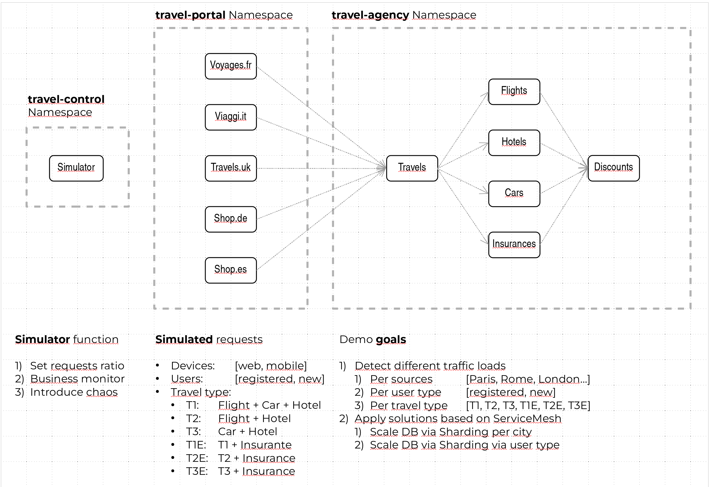
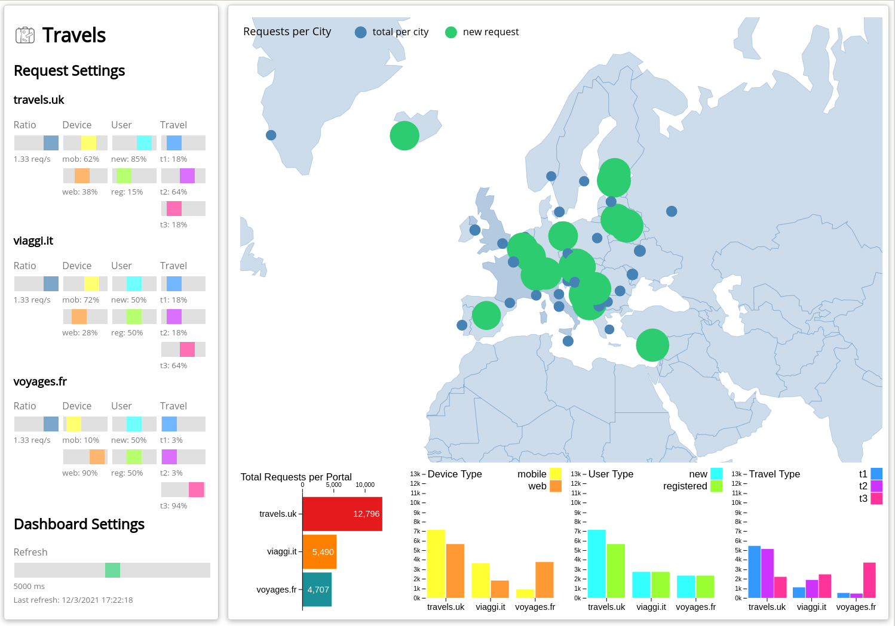
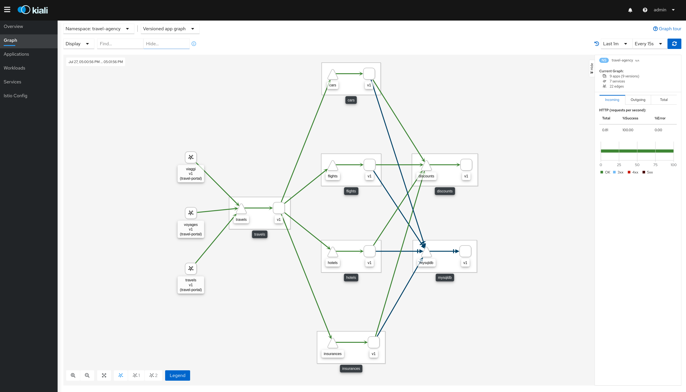

= Travels Demo

A Microservices demo based on Istio Service Mesh tool. 

This goal of this demo is to demonstrate link:https:/istio.io/[Istio] capabilities observed and managed by https://kiali.io[Kiali] tool.

== Platform Install

This demo has been tested using https://istio.io/latest/docs/setup/platform-setup/minikube/[Minikube] and https://istio.io/latest/docs/setup/install/istioctl/#install-a-different-profile[Istio 1.6 Demo Profile]

== Quick Start

Create `travel-agency`, `travel-portal` and `travel-control` namespaces. Add `istio-injection` label and deploy demo app. 

[source,yaml]
----
kubectl create namespace travel-agency
kubectl create namespace travel-portal
kubectl create namespace travel-control

kubectl label namespace travel-agency istio-injection=enabled
kubectl label namespace travel-portal istio-injection=enabled
kubectl label namespace travel-control istio-injection=enabled

kubectl apply -f <(curl -L https://raw.githubusercontent.com/kiali/demos/master/travels/travel_agency.yaml) -n travel-agency
kubectl apply -f <(curl -L https://raw.githubusercontent.com/kiali/demos/master/travels/travel_portal.yaml) -n travel-portal
kubectl apply -f <(curl -L https://raw.githubusercontent.com/kiali/demos/master/travels/travel_control.yaml) -n travel-control

----

Open Kiali dashboard:

[source,bash]
----
istioctl dashboard kiali

----

Expose `travel-control` service to your localhost machine:

[source,bash]
----
kubectl port-forward svc/control 8080:8080 -n travel-control

----

Open http://localhost:8080[Travels Dashboard].

Undeploy the example:

[source,yaml]
----
kubectl delete -f <(curl -L https://raw.githubusercontent.com/kiali/demos/master/travels/travel_agency.yaml) -n travel-agency
kubectl delete -f <(curl -L https://raw.githubusercontent.com/kiali/demos/master/travels/travel_portal.yaml) -n travel-portal
kubectl delete -f <(curl -L https://raw.githubusercontent.com/kiali/demos/master/travels/travel_control.yaml) -n travel-control

kubectl delete namespace travel-agency
kubectl delete namespace travel-portal
kubectl delete namespace travel-control
----

== Travels Demo Design

This demo creates two groups of services to simulate a travel portal scenario.

=== Travel Portal Namespace

In a first namespace called *travel-portal* there will be deployed several travel shops, where typically users access to search and book flights, hotels, cars or insurances.

There will be several shops to simulate that business of every portal may be different. There will be different characteristics of types of travels, channel (web, mobile), or target (new or existing customers).

These workloads may generate different type of traffic to imitate different real scenarios.

All the portals use a service called _travels_ deployed in the *travel-agency* namespace. 

=== Travel Agency Namespace

A second namespace called *travel-agency* will host a set of services created to provide quotes for travels.

A main _travels_ service will be the business entry point for the travel agency. It receives a destination city and a user as parameters and it calculates all elements that compose a travel budget: airfares, lodging, car reservation and travel insurances.

There are several services that calculates a separate price and the travels service is responsible to aggregate them in a single response.

Additionally, some users like _registered_ users can have access to special discounts, managed as well by an external service.

Service relations between namespaces can be described in the following diagram:

== Travels Dashboard

In the Travels Demo it has been introduced a *business dashboard* with two features:

* Allow to change the settings of every travel shop simulator. Allowing to change the characteristics of the traffic (ratio, device, user, type of travel).
* Providing a *business* view of the total requests generated from the *travel-portal* namespace to the *travel-agency* services, organized with business criteria as grouped per shop, per type of traffic and per city.

== Kiali Dashboard

Travels Demo has introduced a *database* in the example.

A typical flow consists of following steps:

. A portal queries the travels service for available destinations.
. Travels service queries the available hotels and return to the portal shop.
. A user selects a destination and a type of travel, which may include a _flight_ and/or a _car_, _hotel_ and _insurance_.
. _Cars_, _Hotels_ and _Flights_ may have available discounts depending of user type.

All traffic and relation between services and workloads can be visualized using Kiali:

== Chaos Engineering

The _flights_ service can be made to behave badly for some types fo requests based on devices (web mobile), user type (new/registered) and/or portal (travels.uk, viaggi.it & voyages.fr).  

To add delay into the service the following env variable must be set:

* CHAOS_MONKEY=true       - Set to _true_ to enable a delay 
* CHAOS_MONKEY_SLEEP=4000 - Set the delay in ms (e.g. 1000 for 1s) 

You must also set one or more of the following variables:

* CHAOS_MONKEY_DEVICE  - Set the device, e.g. mobile or web 
* CHAOS_MONKEY_PORTAL  - Set the portal, e.g. travels.uk, viaggi.it or voyages.fr 
* CHAOS_MONKEY_USER    - Set to new or registered 

Example of how to make the flights service respond with 4 seconds delay for all mobile users:

[source,yaml]
----
kubectl set env deploy flights-v1 CHAOS_MONKEY=true CHAOS_MONKEY_SLEEP=4000 CHAOS_MONKEY_DEVICE=mobile -n travel-agency
----
Tip: If you want all requests to be affected, you need to ensure all requests from the portals are from mobile users by moving the _Device's_ yellow switch to the right for all 3 portals. 

Remove the delay by removing the env varable:

[source,yaml]
----
kubectl set env deploy flights-v1 CHAOS_MONKEY- -n travel-agency 
----

== Feedback

This demo is a pet project but if you think is useful to simulate some scenario, test some use case or you miss some feature, please, feel free to provide us feedback.

In any way: from a comment or even a change in the repo.

Thanks !
